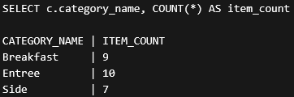

# SQL Practice Queries

This project contains SQL queries demonstrating joins, grouping, filtering, and aggregation techniques.

The queries analyze structured data to generate category summaries, value calculations, low stock reports, and pricing statistics.

## Tools
- Oracle SQL
- SQL*Plus

## Key Concepts
- JOIN operations
- GROUP BY and aggregation
- Filtering and sorting
- Data analysis using SQL
